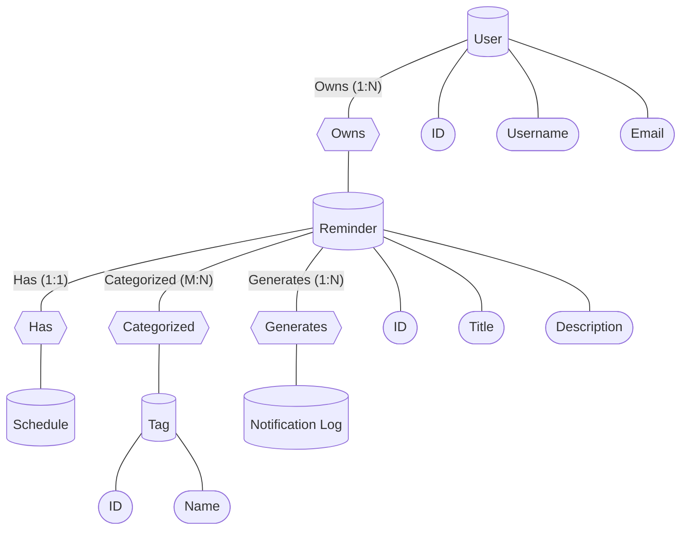
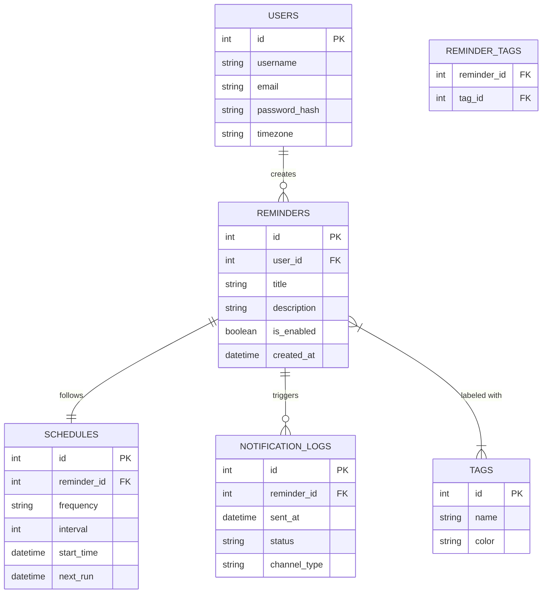

# Database Visualizations

## 1. Conceptual Schema (Peter Chen Notation)

In this notation:
- **Rectangles**: Entities
- **Diamonds**: Relationships
- **Ovals**: Attributes (Simulated with nodes in this diagram)

---

## 2. Logical Schema (Crow's Foot Notation)

This diagram shows the exact table structures, primary keys, and foreign keys.

